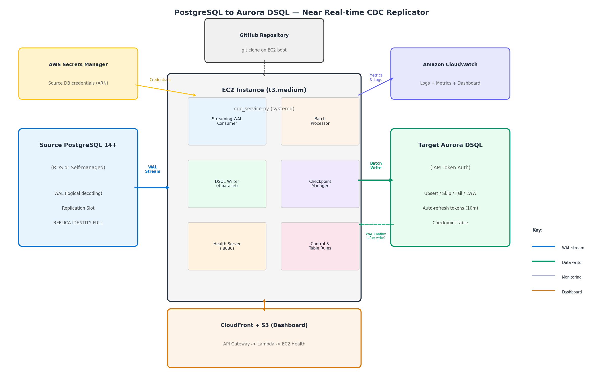
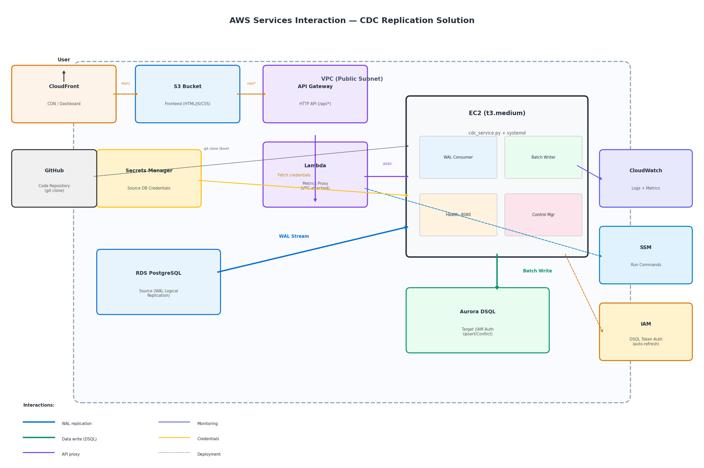

# PostgreSQL to Amazon Aurora DSQL — Near Real-time CDC Replicator

A production-ready Change Data Capture (CDC) tool that replicates data from PostgreSQL 14+ to Amazon Aurora DSQL in near real-time using logical replication.

---

## Architecture



### AWS Service Architecture




---

## Features

- **Near real-time replication** — streams WAL changes with sub-second latency
- **Zero data loss** — WAL is only confirmed after successful DSQL write
- **Configurable conflict resolution** — upsert, skip, fail, or last_write_wins
- **DMS-style table mapping** — include/exclude rules with `%` wildcards
- **Secrets Manager integration** — source credentials via ARN (no plaintext passwords)
- **IAM token authentication** — auto-refreshing DSQL tokens (every 10 min)
- **Built-in load testing** — fully isolated sample tables with dedicated replication slot
- **Web dashboard** — step-by-step configuration, monitoring, and control
- **One-click CloudFormation deployment** — single template deploys everything
- **Pre-flight connectivity check** — verifies source & target before starting

---

## Prerequisites

### AWS Resources (must exist before deployment)

| Resource | Description |
|----------|-------------|
| **VPC** | With at least one public subnet (EC2 needs internet access for git clone) |
| **Security Group** | Allow inbound port 8080 (self-referencing for Lambda→EC2 health checks), outbound all. **Must allow traffic from itself on port 8080** — the Lambda (attached to same SG) calls the EC2 health server. |
| **RDS PostgreSQL 14+** | Source database in the same VPC, with logical replication enabled |
| **Aurora DSQL Cluster** | Target cluster (can be in any region) |
| **Secrets Manager Secret** | Source DB credentials stored in JSON format |
| **GitHub Repository** | This repo must be public (for EC2 UserData git clone) |

### Source PostgreSQL Requirements

#### 1. Database Parameters (RDS Parameter Group)

| Parameter | Required Value | Notes |
|-----------|---------------|-------|
| `wal_level` | `logical` | Enables logical decoding (requires reboot) |
| `max_replication_slots` | `≥ 2` | One for CDC, one for load testing |
| `max_wal_senders` | `≥ 2` | Concurrent WAL streaming connections |
| `rds.logical_replication` | `1` | RDS-specific: enables logical replication |

#### 2. Database User Permissions

The user in your Secrets Manager secret needs these permissions:

```sql
-- Minimum required permissions for CDC:
GRANT rds_replication TO your_user;           -- RDS: allows creating replication slots
-- OR for self-managed PostgreSQL:
ALTER USER your_user WITH REPLICATION;         -- Allows replication connections

-- Required on each database being replicated:
GRANT CONNECT ON DATABASE your_db TO your_user;
GRANT USAGE ON SCHEMA public TO your_user;
GRANT SELECT ON ALL TABLES IN SCHEMA public TO your_user;

-- If you need the CDC user to create the replication slot:
-- (Alternatively, create the slot as a superuser beforehand)
```

#### 3. Replication Slot (create before starting CDC)

```sql
-- Create the logical replication slot:
SELECT pg_create_logical_replication_slot('dsql_cdc_slot', 'test_decoding');

-- Verify it was created:
SELECT slot_name, plugin, active FROM pg_replication_slots;
```

> ⚠️ **Important:** The replication slot starts capturing WAL from the moment it's created. Any changes made BEFORE slot creation are NOT captured. For initial data load, use `pg_dump` separately.

#### 4. Table Requirements (CRITICAL)

Each table you want to replicate **must** have REPLICA IDENTITY configured:

```sql
-- REQUIRED for UPDATE and DELETE replication:
ALTER TABLE your_table REPLICA IDENTITY FULL;

-- Check current replica identity:
SELECT relname, 
  CASE relreplident 
    WHEN 'f' THEN 'FULL ✓'
    WHEN 'd' THEN 'DEFAULT (primary key only)'
    WHEN 'n' THEN 'NOTHING ✗ (will not replicate UPDATEs/DELETEs)'
    WHEN 'i' THEN 'INDEX'
  END as replica_identity
FROM pg_class 
WHERE relname IN ('your_table_1', 'your_table_2');
```

| REPLICA IDENTITY | INSERT | UPDATE | DELETE | Recommendation |
|-----------------|--------|--------|--------|----------------|
| `FULL` | ✅ | ✅ | ✅ | **Recommended** — all operations replicate |
| `DEFAULT` | ✅ | ✅* | ✅* | OK if table has a PRIMARY KEY (*uses PK for identification) |
| `NOTHING` | ✅ | ❌ | ❌ | **Not recommended** — only INSERTs replicate |

> **Best practice:** Always use `REPLICA IDENTITY FULL` unless you have performance concerns on high-throughput tables with primary keys.

### Secrets Manager Secret Format

```json
{
  "username": "postgres",
  "password": "your-password",
  "host": "your-rds-endpoint.us-east-1.rds.amazonaws.com",
  "port": 5432,
  "dbname": "postgres"
}
```

The CDC service fetches this secret at startup and builds the connection string automatically. Special characters in passwords are handled correctly.

### Target Aurora DSQL Requirements

#### Tables Must Pre-Exist

Target tables must be created on DSQL **before** starting replication. The CDC tool does NOT replicate DDL (CREATE TABLE, ALTER TABLE, etc.).

#### DSQL-Compatible Schema

When creating tables on DSQL, adapt your source schema for these restrictions:

| Source (PostgreSQL) | Target (DSQL) | Notes |
|--------------------|--------------:|-------|
| `SERIAL` / `BIGSERIAL` | `INT` / `BIGINT` | Use application-generated IDs or UUIDs |
| `FOREIGN KEY` constraints | Remove them | DSQL doesn't enforce foreign keys |
| `text[]`, `int[]` (arrays) | `JSONB` | DSQL doesn't support PostgreSQL array types |
| `CREATE INDEX` | Supported | DSQL supports indexes |
| Multiple `CREATE TABLE` in one transaction | One per transaction | Each DDL must be in its own connection |

#### Example: Converting DDL for DSQL

```sql
-- SOURCE (PostgreSQL):
CREATE TABLE orders (
  id SERIAL PRIMARY KEY,
  customer_id INT REFERENCES customers(id),
  items text[],
  status VARCHAR(20) DEFAULT 'pending'
);

-- TARGET (DSQL) — adapted:
CREATE TABLE orders (
  id INT PRIMARY KEY,
  customer_id INT,
  items JSONB,
  status VARCHAR(20) DEFAULT 'pending'
);
```

---

## Deployment (One-Click CloudFormation)

### Option A: Deploy directly from the public repo (quickest)

You can use the existing public repository directly — no fork needed:

1. **Download the template** from GitHub:
   ```
   https://raw.githubusercontent.com/mathurravi23/pg-dsql-cdc/main/infra/master-stack.yaml
   ```
   Save the file locally (right-click → Save As, or use `curl`):
   ```bash
   curl -o master-stack.yaml https://raw.githubusercontent.com/mathurravi23/pg-dsql-cdc/main/infra/master-stack.yaml
   ```

2. **Deploy via CloudFormation Console:**
   - Open **CloudFormation** → Create Stack → **Upload a template file**
   - Upload the downloaded `master-stack.yaml`
   - Use `GitHubRepoOwner = mathurravi23` and `GitHubRepoName = pg-dsql-cdc`

3. **Or deploy via CLI:**
   ```bash
   aws cloudformation create-stack \
     --stack-name pg-dsql-cdc \
     --template-body file://master-stack.yaml \
     --capabilities CAPABILITY_IAM \
     --parameters ParameterKey=VpcId,ParameterValue=<your-vpc> \
                  ParameterKey=SubnetIds,ParameterValue=<your-subnet> \
                  ParameterKey=SecurityGroupId,ParameterValue=<your-sg> \
                  ParameterKey=GitHubRepoOwner,ParameterValue=mathurravi23 \
                  ParameterKey=GitHubRepoName,ParameterValue=pg-dsql-cdc \
     --region us-east-1
   ```

### Option B: Fork the repo first (recommended for customization)

If you want to customize the CDC service, modify table mappings, or make code changes:

1. **Fork the repository:**
   - Go to [github.com/mathurravi23/pg-dsql-cdc](https://github.com/mathurravi23/pg-dsql-cdc)
   - Click **Fork** → create under your GitHub account/org
   - Your fork URL will be: `https://github.com/<your-username>/pg-dsql-cdc`

2. **Deploy from your fork:**
   - Use `GitHubRepoOwner = <your-username>` in the stack parameters
   - The EC2 instance will `git clone` from YOUR fork
   - Any changes you push to your fork will be picked up on next `git pull`

### Deploy the Stack

1. Open **CloudFormation** → Create Stack → Upload template (or use S3 URL above)
2. Upload `infra/master-stack.yaml` (if using Option B, download from your fork)
3. Fill in parameters:

| Parameter | Description | Example |
|-----------|-------------|---------|
| VpcId | VPC where RDS resides | vpc-0636bd5b5bf187e9b |
| SubnetIds | Public subnet(s) | subnet-abc123 |
| SecurityGroupId | SG with port 8080 self-referencing | sg-xyz789 |
| GitHubRepoOwner | GitHub username or org | mathurravi23 |
| GitHubRepoName | Repository name | pg-dsql-cdc |
| GitHubBranch | Branch to deploy | main |
| SlotName | Logical replication slot name | dsql_cdc_slot |
| ConflictMode | Conflict handling strategy | upsert |
| BatchSize | Events per batch | 1000 |

4. Check **"I acknowledge that AWS CloudFormation might create IAM resources"**
5. Click **Create Stack** (~10 min to complete)

### Step 2: Access the Dashboard

After stack creation:
1. Go to **CloudFormation → Outputs**
2. Find `DashboardURL` — open in browser
3. The dashboard has 4 steps to follow in order

---

## Post-Deployment Setup (Dashboard)

### Step 1: Configuration

1. **Source PostgreSQL** — Enter your Secrets Manager ARN:
   ```
   arn:aws:secretsmanager:us-east-1:123456789:secret=[REDACTED_PASSWORD]
   ```
2. **Target DSQL** — Enter the DSQL cluster endpoint:
   ```
   your-cluster-id.dsql.us-east-1.on.aws
   ```
3. Click **Test Connectivity** to verify both connections
4. Click **Save DSN**
5. Set **Batch Size**, **Conflict Mode**, **Slot Name** → **Save Configuration**

### Step 2: Test with Sample Data (Optional)

1. Click **▶ Start Load Test**
2. The load test creates its own `sample_*` tables and dedicated slot
3. Monitor the "Sample Table Replication Status" table
4. Verify data appears on target DSQL
5. Test slot is automatically cleaned up after completion

### Step 3: Table Selection for Replication

Define which tables to replicate using DMS-style JSON rules:

```json
{
  "rules": [
    {
      "rule-type": "selection",
      "rule-id": "1",
      "rule-name": "include-all-public",
      "object-locator": {"schema-name": "public", "table-name": "%"},
      "rule-action": "include"
    },
    {
      "rule-type": "selection",
      "rule-id": "2",
      "rule-name": "exclude-temp-tables",
      "object-locator": {"schema-name": "public", "table-name": "tmp_%"},
      "rule-action": "exclude"
    }
  ]
}
```

Click **Apply Rules**.

### Step 4: Replication Task

1. Click **▶ Start** to begin replication
2. Monitor the table status for events applied/failed
3. Click **⏹ Stop** to pause (WAL is held by PostgreSQL, no data loss)

---

## Configuration Reference

### Environment Variables (`.env`)

| Variable | Required | Description |
|----------|----------|-------------|
| SOURCE_DSN | Yes | Secrets Manager ARN or raw PostgreSQL DSN |
| TARGET_DSN | Yes | `host=<endpoint> port=5432 dbname=postgres user=admin sslmode=require` |
| DSQL_HOSTNAME | Yes | Aurora DSQL cluster endpoint |
| DSQL_REGION | Yes | AWS region of DSQL cluster |
| SLOT_NAME | Yes | PostgreSQL logical replication slot name |
| CONFLICT_MODE | No | `upsert` (default), `skip`, `fail`, `last_write_wins` |
| BATCH_SIZE | No | Events per batch (default: 1000) |
| PARALLEL_WORKERS | No | Concurrent DSQL writers (default: 4) |
| DECODING_PLUGIN | No | `test_decoding` (default) or `pgoutput` |
| FLUSH_INTERVAL_MS | No | Max time before batch flush (default: 500) |
| HEALTH_PORT | No | Health server port (default: 8080) |
| METRICS_ENABLED | No | CloudWatch metrics (default: true) |

### Conflict Resolution Modes

| Mode | Behavior |
|------|----------|
| **upsert** | INSERT or UPDATE on conflict (default, recommended) |
| **skip** | Skip conflicting rows silently |
| **fail** | Error on conflict (batch fails) |
| **last_write_wins** | Always overwrite with latest value |

### Replication Mode

Controls how events are applied to the target Aurora DSQL:

| Mode | Description | Throughput | Ordering |
|------|-------------|:----------:|:--------:|
| **Batch Processing** (default) | Events are grouped by table and applied in parallel using multiple writer threads | Higher (~4x) | Intra-table: strict. Cross-table: relaxed within a batch |
| **Commit Order** | Events are applied sequentially in a single connection, preserving the exact source commit order | Lower | Strict cross-table ordering |

#### When to use each mode

**Batch Processing** (recommended for most workloads):
- Best for high-throughput replication (hundreds of events/second)
- Events for the same table are always applied in correct order
- Events across different tables within a single batch (~500ms window) may be applied in a different order than on the source
- Safe when your application doesn't rely on cross-table read consistency during active replication

**Commit Order** (use when strict ordering matters):
- All events are applied to DSQL in the exact order they were committed on the source
- Uses a single connection (no parallelism) — lower throughput
- Required when your application reads from DSQL during replication and expects cross-table referential consistency at all times
- Example: if a source transaction inserts into `orders` then `order_items`, Commit Order guarantees `orders` is written first

#### Impact on target apply

| Scenario | Batch Processing | Commit Order |
|----------|:---------------:|:------------:|
| INSERT into `orders` then `order_items` (same txn) | `order_items` may arrive before `orders` | `orders` always written first |
| UPDATE `accounts` then INSERT `audit_log` (same txn) | May apply in either order | Exact source order preserved |
| High-volume INSERTs to a single table | 4 parallel writers, high throughput | Single writer, sequential |
| Cross-table JOIN reads during replication | Brief inconsistency possible (~500ms) | Always consistent |

> **Note:** Aurora DSQL does not enforce foreign key constraints, so cross-table ordering differences in Batch mode do not cause write failures. The choice depends on your application's read-consistency requirements during active replication.

---

## Monitoring

### CloudWatch Dashboard

A CloudWatch dashboard is auto-created with:
- Events Applied/Failed per minute
- Replication Lag (bytes)
- Batch Queue Depth
- Service Health

### Health Endpoint

```bash
curl http://<ec2-private-ip>:8080/health
```

Returns:
```json
{
  "healthy": true,
  "streaming": true,
  "events_applied": 73015,
  "events_failed": 0,
  "lag_bytes": 0,
  "control_state": "running",
  "slot_name": "dsql_cdc_slot",
  "batch_size": 1000,
  "conflict_mode": "upsert"
}
```

### CloudWatch Logs

| Log Group | Content |
|-----------|---------|
| `/ec2/<stack-name>-cdc` | CDC service logs (replication events, errors) |
| `/ec2/<stack-name>-cdc` (loadtest stream) | Load test output |

---

## Data Loss Prevention

The following measures are implemented to minimize the risk of data loss during replication:

### Measures Taken

1. **WAL feedback only after confirmed write** — PostgreSQL WAL position is NOT acknowledged until data is successfully written to Aurora DSQL. If the service crashes mid-batch, unacknowledged events remain in the WAL and are replayed on restart.

2. **Safe checkpoint advancement** — The checkpoint LSN does not advance past failed events. If a batch has partial failures, only the successfully written portion is checkpointed.

3. **Pre-flight connectivity check** — Before starting replication, the service verifies that both source PostgreSQL and target DSQL are reachable. This prevents consuming WAL when the target is unavailable.

4. **WAL retention on pause/stop** — When replication is paused or stopped, PostgreSQL retains all WAL segments in the replication slot until consumption resumes. No data is discarded during downtime.

5. **Input validation and sanitization** — User inputs (DSN, table names) are validated before use in shell commands or SQL queries to prevent injection-based corruption.

### Recovery Behavior

| Scenario | Expected Behavior |
|----------|----------|
| Service crash / restart | Resumes from last saved checkpoint LSN; replays unconfirmed events |
| DSQL temporarily unavailable | Batch write fails; events are retried on next flush cycle |
| Network partition (source side) | PostgreSQL holds WAL in the slot; resumes from last confirmed LSN |
| IAM token expiration | Tokens auto-refresh every 10 min (TTL: 15 min); brief failures retried |

> **Note:** While these measures significantly reduce the risk of data loss, edge cases may exist in untested failure scenarios (e.g., simultaneous source and target failures, corrupted WAL segments). Users are encouraged to validate replication integrity for their specific workloads.

---

## Limitations

### DML Only — No DDL Replication

This tool replicates **DML operations only** (INSERT, UPDATE, DELETE). It does NOT replicate DDL (CREATE TABLE, ALTER TABLE, DROP TABLE, CREATE INDEX, etc.).

**What this means for you:**

| Operation | Replicated? | What to do |
|-----------|:-----------:|-----------|
| `INSERT INTO table ...` | ✅ Yes | Automatic |
| `UPDATE table SET ...` | ✅ Yes | Automatic (requires REPLICA IDENTITY) |
| `DELETE FROM table ...` | ✅ Yes | Automatic (requires REPLICA IDENTITY) |
| `CREATE TABLE ...` | ❌ No | Create on DSQL manually first |
| `ALTER TABLE ADD COLUMN ...` | ❌ No | Apply on both source AND target manually |
| `ALTER TABLE DROP COLUMN ...` | ❌ No | **Stop replication first**, apply on both, restart |
| `DROP TABLE ...` | ❌ No | Stop replication, remove from rules, drop on target |
| `CREATE INDEX ...` | ❌ No | Create on DSQL separately |
| `TRUNCATE ...` | ❌ No | Manual truncate on target if needed |

#### DDL Change Procedure (to avoid breaking replication)

1. **Stop replication** (Step 4 → Stop)
2. **Apply DDL on target (DSQL) first**
3. **Apply DDL on source (PostgreSQL)**
4. **Restart replication** (Step 4 → Start)

> ⚠️ **If you add a column on source without adding it on target:** The CDC service will fail to write rows with the new column. Always update the target schema first.

> ⚠️ **If you drop a column on source without dropping on target:** Replication continues but the dropped column will have NULL values on target.

### Other Limitations

| Limitation | Details |
|------------|---------|
| **DSQL type restrictions** | No `SERIAL`, `ARRAY`, `FOREIGN KEY`, multi-DDL transactions |
| **Single source** | One PostgreSQL source per deployment |
| **No initial full load** | Only captures changes after slot creation (use `pg_dump` for initial data) |
| **test_decoding plugin** | `pgoutput` support is implemented but less tested |
| **No schema evolution** | Adding/removing columns requires stop → manual DDL → restart |
| **Tables must pre-exist on target** | Target tables must be created manually before replication |
| **REPLICA IDENTITY required** | Source tables need `REPLICA IDENTITY FULL` for UPDATE/DELETE |
| **WAL accumulation when stopped** | PostgreSQL retains WAL while replication is paused — monitor disk space |
| **No LOB/TOAST handling** | Large objects (>1GB fields) may cause issues |
| **No sequence replication** | Auto-increment counters don't sync — use UUIDs or application-generated IDs |

---


## Manual Operations

### SSH to EC2

```bash
# Via SSM Session Manager (no SSH key needed):
aws ssm start-session --target <instance-id> --region us-east-1
```

### Restart Service

```bash
sudo systemctl restart cdc-service
```

### View Logs

```bash
sudo tail -f /var/log/cdc/cdc-service.log
```

### Change Control State

```bash
# Stop replication (service stays up):
echo '{"state": "stopped"}' | sudo tee /opt/cdc/control.json

# Start replication:
echo '{"state": "running"}' | sudo tee /opt/cdc/control.json
```

### Drop Load Test Artifacts

```bash
set -a && source /opt/cdc/.env && set +a
psql "$SOURCE_DSN" -c "
DROP TABLE IF EXISTS sample_order_items, sample_payments, sample_shipments,
  sample_orders, sample_inventory, sample_products, sample_customers CASCADE;
SELECT pg_drop_replication_slot('sample_cdc_slot')
  FROM pg_replication_slots WHERE slot_name = 'sample_cdc_slot';
DROP PUBLICATION IF EXISTS sample_cdc_pub;
"
rm -f /tmp/loadtest_tables.json /tmp/loadtest_output.log
```

---

## Project Structure

```
pg-dsql-cdc/
├── cdc_service.py              # Main CDC service (streaming consumer, batch writer, health server)
├── load_test_orders.py         # Isolated load test (sample_* tables, own slot)
├── setup_source.py             # One-time source PG setup helper
├── type_mapper.py              # Optional type casting (opt-in via TYPE_MAPPING env)
├── requirements.txt            # Python dependencies (psycopg2-binary, boto3)
├── infra/
│   └── master-stack.yaml       # CloudFormation template (one-click deploy)
├── frontend/
│   ├── index.html              # Dashboard SPA
│   ├── css/style.css           # Light theme styles
│   └── js/app.js               # Dashboard logic
└── api/
    └── lambda_metrics.py       # Reference Lambda code (inline in CFN template)
```

---

## Estimated Cost

The following AWS resources are deployed and incur charges:

| Resource | Type | Estimated Monthly Cost |
|----------|------|----------------------:|
| EC2 Instance | t3.medium (24/7) | ~$30 |
| CloudFront Distribution | Low traffic | ~$1-5 |
| S3 Buckets (2) | Frontend + Archive | ~$1-3 |
| API Gateway | HTTP API | ~$1-3 |
| Lambda | Proxy (low invocations) | ~$0-1 |
| CloudWatch | Dashboard + Logs + Metrics | ~$3-10 |
| **Total (CDC infrastructure only)** | | **~$36-52/month** |

> **Note:** This does NOT include the cost of your source RDS instance or Aurora DSQL cluster — those are pre-existing resources you provision separately.

> **Cost optimization:** You can stop the EC2 instance when not replicating. WAL is retained by PostgreSQL (replication slot holds it) and replication resumes from where it left off. However, accumulated WAL consumes storage on your RDS instance.

---

## Troubleshooting

### 504 Gateway Timeout on Dashboard / API calls

**Symptom:** Dashboard shows "Failed to fetch" or browser returns 504 on `/api/health`.

**Cause:** The Lambda function (VPC-attached) cannot reach the EC2 health server on port 8080.

**Fix:**
1. Ensure the Security Group allows **self-referencing inbound on port 8080**:
   - Go to EC2 Console → Security Groups → Select your SG
   - Inbound Rules → Add Rule:
     - Type: Custom TCP
     - Port: 8080
     - Source: **the same Security Group ID** (self-referencing)
2. Verify the EC2 instance and Lambda are in the **same security group** and **same subnet(s)**

### Service crashes on startup (exit code 1)

**Symptom:** `systemctl status cdc-service` shows `Failed with result 'exit-code'`.

**Fix:**
```bash
# Check what's failing:
sudo /usr/bin/python3.11 /opt/cdc/cdc_service.py 2>&1 | head -20
```

Common causes:
- **Port 8080 already in use** — previous crash loop left zombie processes:
  ```bash
  sudo fuser -k 8080/tcp
  sleep 2
  sudo systemctl start cdc-service
  ```
- **Invalid SOURCE_DSN** — Secrets Manager ARN is wrong or IAM permission missing:
  ```bash
  # Test secret access:
  set -a && source /opt/cdc/.env && set +a
  python3.11 -c "import boto3,json,os; c=boto3.client('secretsmanager',region_name='us-east-1'); print(json.loads(c.get_secret_value(SecretId=os.environ['SOURCE_DSN'])['SecretString']).keys())"
  ```
- **Missing `.env` values** — check all required vars are set:
  ```bash
  cat /opt/cdc/.env
  ```

### Git clone fails during stack creation

**Symptom:** EC2 instance has no code at `/opt/cdc/` after stack creation.

**Cause:** Network not ready at boot time, or repo is private.

**Fix:**
```bash
# SSM into the instance:
aws ssm start-session --target <instance-id> --region <region>

# Manually clone:
cd /opt/cdc
sudo git clone https://github.com/<owner>/<repo>.git .
sudo python3.11 -m pip install psycopg2-binary boto3
sudo systemctl restart cdc-service
```

### Test Connectivity fails for source

**Symptom:** "Connection failed — ensure the database is running and credentials are correct"

**Causes:**
- RDS instance is stopped → start it and wait 5 min
- Security Group doesn't allow EC2 → RDS on port 5432
- Secret ARN is incorrect or permissions missing
- Wrong `dbname` in secret (check actual database name)

### Dashboard shows blank configuration (no values populated)

**Symptom:** Step 1 fields are empty even though `.env` has values.

**Causes:**
- CDC service is not running (health endpoint unreachable)
- Lambda getting 503 from health server → service may be in crash loop

**Fix:**
```bash
# Verify health server is up:
curl -s localhost:8080/health | python3 -m json.tool | head -5

# If empty response, restart:
sudo fuser -k 8080/tcp
sudo systemctl restart cdc-service
```

### Replication running but 0 events applied

**Symptom:** Health shows `streaming: true, events_applied: 0` even after inserting data.

**Causes:**
1. **Table rules don't match** — check `/opt/cdc/table_rules.json` matches your table names exactly (case-sensitive, `employees` ≠ `employee`)
2. **Wrong replication slot** — slot may have been consumed past your changes. Check:
   ```bash
   psql "$SOURCE_DSN" -c "SELECT slot_name, confirmed_flush_lsn, pg_current_wal_lsn() FROM pg_replication_slots;"
   ```
3. **REPLICA IDENTITY not set** — table needs `ALTER TABLE x REPLICA IDENTITY FULL`
4. **DSQL write failing silently** — check logs:
   ```bash
   sudo tail -50 /var/log/cdc/cdc-service.log | grep -i "error\|fail"
   ```

### Load test fails with authentication error

**Symptom:** Load test output shows "password authentication failed" or DSQL token error.

**Causes:**
- `DSQL_HOSTNAME` or `DSQL_REGION` not set in `.env`
- Source DSN quotes issue — ensure no literal `"` in the `.env` values for systemd

**Fix:** Complete Step 1 (Configuration → Test Connectivity → Save) before running load test.

### Stack deletion takes 15-20 minutes

**Expected behavior.** CloudFront distribution deletion requires global edge propagation. Lambda VPC ENI cleanup adds additional time. No action needed — just wait.

---

## Cleanup

To remove all resources created by this solution:

### Step 1: Delete the CloudFormation stack

```bash
aws cloudformation delete-stack --stack-name pg-dsql-cdc --region us-east-1
```

Or via Console: **CloudFormation** → Select stack → **Delete**

> The stack's custom resource will automatically empty the S3 buckets before deletion. Stack deletion takes 15-20 minutes (CloudFront global propagation + Lambda VPC ENI cleanup).

### Step 2 (Optional): Drop the replication slot on source

If you created a replication slot on your source PostgreSQL, drop it to stop WAL accumulation:

```sql
-- Drop the CDC replication slot:
SELECT pg_drop_replication_slot('dsql_cdc_slot');

-- Drop the load test slot if it exists:
SELECT pg_drop_replication_slot('sample_cdc_slot') 
  FROM pg_replication_slots WHERE slot_name = 'sample_cdc_slot';
```

> ⚠️ If you don't drop the replication slot, PostgreSQL will continue accumulating WAL indefinitely, consuming disk space on your RDS instance.

### Step 3 (Optional): Empty S3 buckets manually (if stack delete fails)

If the stack deletion fails due to non-empty buckets:

```bash
aws s3 rm s3://pg-dsql-cdc-dashboard-<account-id> --recursive --region us-east-1
aws s3 rm s3://pg-dsql-cdc-archive-<account-id> --recursive --region us-east-1
```

Then retry the stack deletion.

### Step 4 (Optional): Remove sample load test tables from DSQL

The load test creates `sample_*` tables on the target DSQL. To remove them:

```sql
DROP TABLE IF EXISTS sample_order_items;
DROP TABLE IF EXISTS sample_payments;
DROP TABLE IF EXISTS sample_shipments;
DROP TABLE IF EXISTS sample_orders;
DROP TABLE IF EXISTS sample_inventory;
DROP TABLE IF EXISTS sample_products;
DROP TABLE IF EXISTS sample_customers;
```

> **Note:** Your replicated production tables are NOT affected by cleanup — only drop them if you no longer need the data.

---

## License

This project is licensed under the MIT-0 (MIT No Attribution) License. See the [LICENSE](LICENSE) file for details.

---

## Feedback

Send feedback: ravimat@amazon.com
